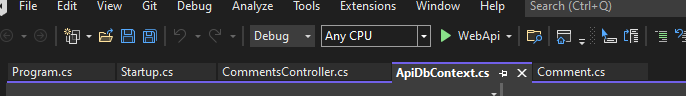
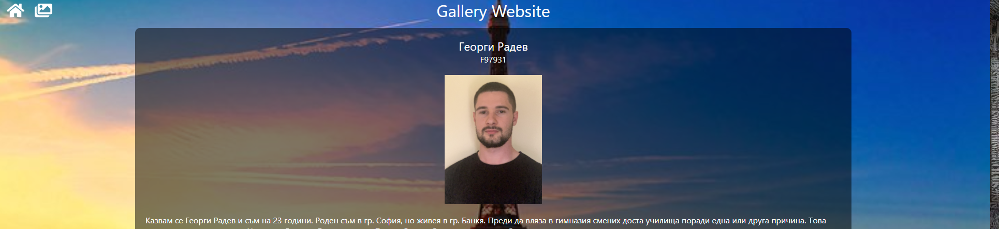
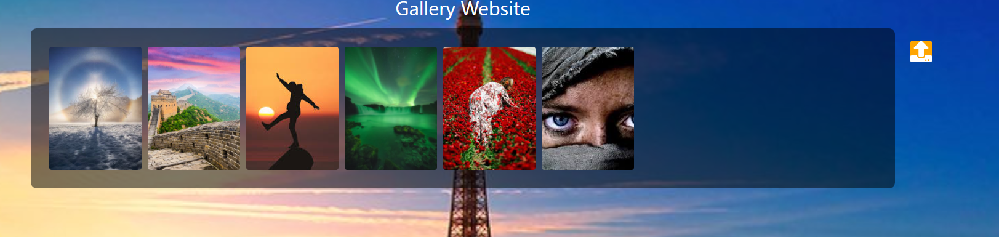
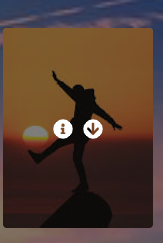
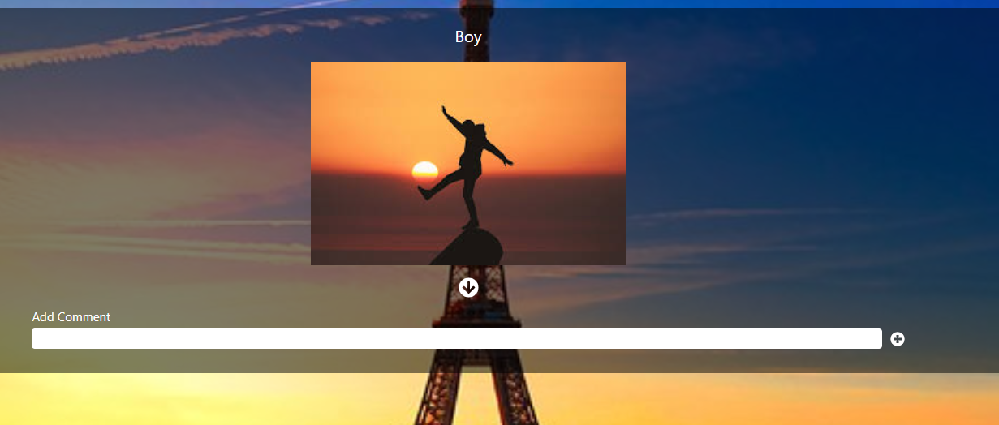
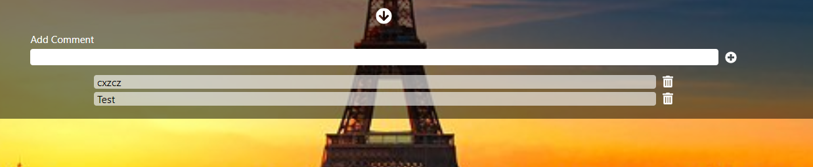
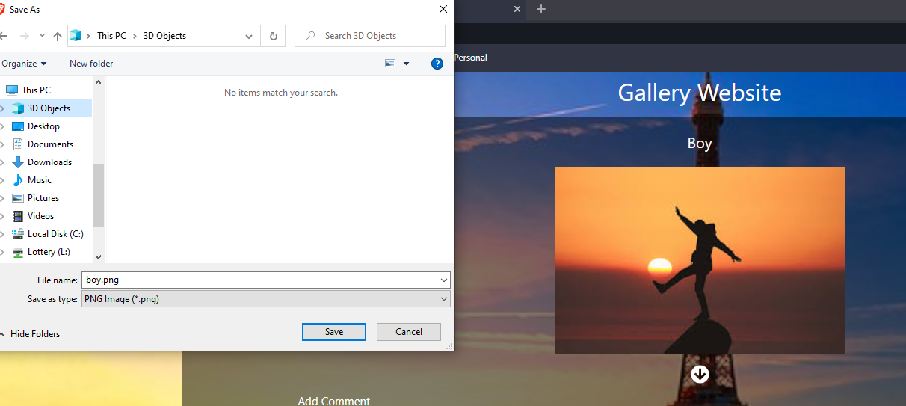

# NBU C# & JavaScript project
Project for my NBU course Client-server technologies
## Description

Small university project written with C# as backend and React as frontend technologie. Application for reading my biography, switching between pages, adding new images, dowloading them and adding comments underneath.

## Project Instaling

1. Go to server2/WebApi folder and start the application from the solution **"WebApi.sln"**.
      - Run the app with the green play button and go back to the folder structure
      
      - **If you go to the following link: https://localhost:3005/swagger/index.html you can use swagger to send requests instead of React client**

2. Startup client and open folder **client**

3. After files are setup go in terminal and run the following commands with the given order:

- `npm install` - this will install all needed packages to run the application
- `npm start` - this will start the project

4. **Go to the following link: https://localhost:3000**

7. Here some photos in the web client

      - Homepage
      
    

      - Gallery page

      
    
      - Single image hover

   
    
      - Image details

   
    
      - Image comments

      
    

      - Image comments

   
    